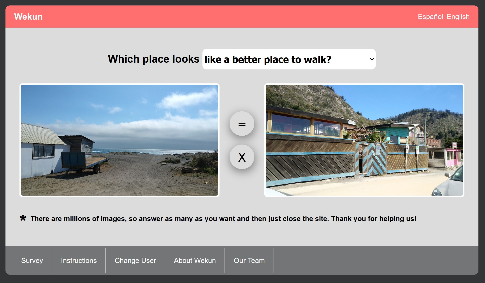

# Image-based app example

When working in my graduate thesis I needed to conduct an infinite survey of pair of images. Ok, it was not infinite, but I wanted maximize the responses by only asking a single registration surveyee.

The survey is split into three sections.
* **Section 1 - Registration:**
  Will ask seven questions to characterize the users. This info is saved in our database with a generated user_id. That same user ID is also stored in the cookies to be included in all further answers. This allows us to maximize the time each user would dedicate to our survey.
* **Section 2 - Infinite loop of image comparisons:**
  This section presents -randomly selected- pairs of images associated to a question addresing the users perception of the urban landscape. The users has three possible answers: Images 1 answers better than Image 2, they look the same, or Images 2 answers better than Image 1.
* **Section 3 - Further characterization:**
  After ten responses we showed a button on the top of the screen inviting the users to answer 10 more questions to understand their background. 


Preview of the survey
:----------------------|
||

## Libraries

* Framework: Flask
* Database server: PostgreSQL

My core training is in Transportartion Engineering, so I learnt from scratch to develope the app for my thesis. I hope this basic strutcture is usefull to someone else who need an image-based survey a little bit more customizable than online platformas as Google Forms, Qualtrics or Survey Monkey.

## Install dependencies
```
python -m venv env
env\Scripts\activate 
python -m pip install -r requirements.txt
```


# Run survey Locally
## Set database URI in .\app\__init__.py
```
# app.config['SQLALCHEMY_DATABASE_URI'] = os.environ['DATABASE_URL']
app.config['SQLALCHEMY_DATABASE_URI'] = 'sqlite:///site.db'
```

## Initialize database
```
python
>>> from app import db
>>> db.create_all()
>>> db.session.commit()
>>> quit()
```
This will create a new file `app/site.db`

## Run app in Localserver
```
set FLASK_APP=app
python -m flask run
```
